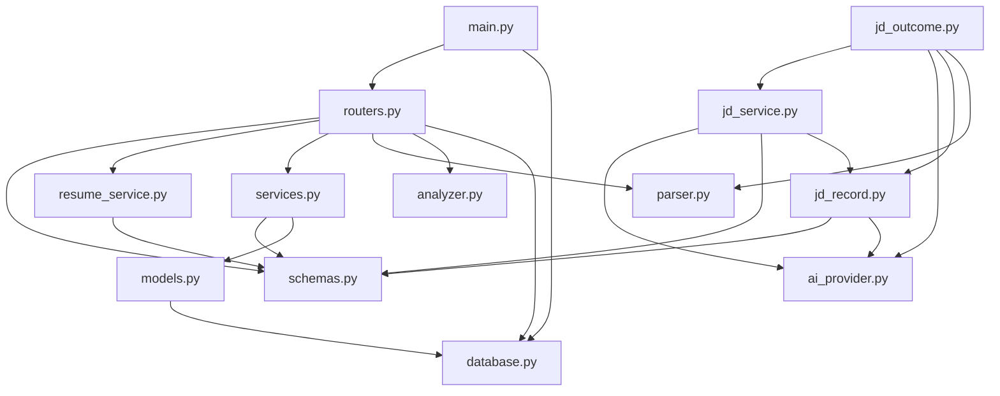

# RoleRadar

RoleRadar is a Job Intelligence & Skill-Gap Analysis Platform for students.

The goal of this project is to help users parse job descriptions, identify required skills, analyze skill gaps, and track job applications.

## V1 Features

- Extract required skills from job descriptions
- Compare detected job skills with user skills
- Calculate a FitScore
- Display matched and missing skills
- Save application records to SQLite
- Track application status changes
- Display total applications, status counts, and average FitScore
- Visualize application status and FitScore distributions
- Display the Top 5 Missing Skills across saved applications
- Preserve application history across backend and frontend restarts

## How V1 Works

1. The user enters a job description and a comma-separated skills list.
2. The Streamlit frontend sends the input to `POST /analyze-job`.
3. The FastAPI backend extracts job skills and calculates matched skills, missing skills, and FitScore.
4. The frontend displays the analysis result.
5. The user adds company, job title, and application status information.
6. The frontend saves the application through `POST /applications`.
7. The Dashboard loads saved records through `GET /applications`.
8. The user can update an application status through `PATCH /applications/{application_id}`.
9. Dashboard metrics, charts, and application history refresh from the updated records.

## Progress

### Day 1

Completed:

- Set up the project folder structure
- Created and activated a Python virtual environment
- Built a minimal FastAPI backend
- Added backend endpoints:
  - `GET /`
  - `GET /health`
  - `POST /parse-jd`
- Added a rule-based JD parser using a known skills list
- Built a minimal Streamlit frontend
- Added a JD text area and character counter
- Verified backend and frontend locally

### Day 2

Completed:

- Added `requests` to the frontend dependencies
- Connected the Streamlit frontend to the FastAPI `/parse-jd` endpoint
- Added an `Analyze JD` button
- Sent JD text from the frontend to the backend using a POST request
- Displayed detected skills in the frontend
- Added a warning for empty JD input
- Committed the Day 2 frontend-backend integration

### Day 3

Completed:

- Refactored JD parsing logic into a separate parser module
- Added `backend/app/parser.py`
- Moved `KNOWN_SKILLS` into the parser module
- Added `extract_skills()` helper function
- Updated `/parse-jd` to call `extract_skills()`
- Verified the FastAPI `/parse-jd` endpoint after refactor
- Verified the Streamlit frontend still displays detected skills

### Day 4

Completed:

- Started Stage 2 : SkillMap and FitScore preparation
- Added a user skills input field to the Streamlit frontend
- Parsed comma-separated user skills into a Python list
- Trimmed extra spaces from user skill input
- Filtered out empty skill entries
- Displayed user skills in the frontend
- Verified the existing JD skill extraction still works after the frontend update
- Committed and pushed the Day 4 user skills input features

### Day 5

Completed:

- Started comparing detected JD skills with user skills
- Added `jd_skills` as a named frontend variable from the `parse-jd` response
- Added case-insensitive matching between JD skills and user skills
- Displayed matched skills in the Streamlit frontend
- Displayed missing skills in the Streamlit frontend
- Added empty-state messages for no matched skills and no missing skills
- Improved user skills display formatting
- Kept the comparison logic in the frontend for now
- Did not implement FitScore yet

### Day 6

Completed:

- Added a basic FitScore calculation
- Calculated FitScore from matched skills and detected JD skills
- Formatted FitScore as a rounded percentage
- Added protection against division by ZERO
- Added an empty state when no known skills are detected
- Hid matched and missing skill sections when no JD skills are detected
- Verified partial-match, full-match, and empty-detection scenarios
- Kept FitScore calculation in the Streamlit frontend for now

### Day 7

Completed:

- Added `backend/app/analyzer.py`
- Added the `analyze_skill_gap()` backend helper function
- Moved case-insensitive skill comparison into the backend
- Moved matched skills, missing skills, and FitScore calculation into the backend
- Added the `JobAnalysisRequest` Pydantic model
- Added the `POST /analyze-job` endpoint
- Reused `extract_skills()` inside the new analysis endpoint
- Updated the Streamlit frontend to send JD text and user skills together
- Updated the frontend to read analysis results from the backend
- Removed duplicate skill-gap and FitScore calculations from the frontend
- Verified partial-match, full-match, no-match, and empty-detection scenarios
- Kept the existing `POST /parse-jd` endpoint available


### Day 8

Completed:

- Started Stage 3: Application Tracker
- Added the `ApplicationCreate` Pydantic request model
- Defined company, job title, status, FitScore, matched skills, and missing skills fields
- Added temporary in-memory application storage
- Added the `POST /applications` endpoint
- Converted validated Pydantic payloads into dictionaries
- Added temporary sequential application IDs
- Verified successful application creation through Swagger
- Verified invalid JSON and invalid FitScore validation errors
- Documented that in-memory records are lost when the backend restarts
- Identified duplicate POST requests as a limitation for future handling

### Day 9

Completed:

- Replaced temporary in-memory application storage with SQLite
- Added SQLAlchemy as the backend ORM
- Added the database engine, session factory, declarative base, and per-request database dependency
- Added the `Application` SQLAlchemy ORM model
- Created the `applications` database table
- Added database-generated application IDs and creation timestamps
- Stored matched and missing skills using JSON columns
- Updated `POST /applications` to persist records in SQLite
- Added the `ApplicationResponse` Pydantic response model
- Added the `GET /applications` endpoint
- Verified saved application records through Swagger
- Verified that application records persist after a backend restart
- Added the local SQLite database file to `.gitignore`


### Day 10

Completed:

- Connected the Streamlit frontend to the persistent Application Tracker API
- Added Streamlit session state for preserving analysis results across reruns
- Added company, job title, and application status inputs
- Reused FitScore, matched skills, and missing skills in application payloads
- Added the `Save Application` frontend workflow
- Added required-field validation before saving
- Added current-session duplicate submission protection
- Connected the frontend to `GET /applications`
- Added expandable application history records
- Verified application creation through the frontend
- Verified that application history persists after backend and frontend restarts

### Day 11

Completed:

- Added the `ApplicationStatusUpdate` Pydantic request model
- Added the `PATCH /applications/{application_id}` endpoint
- Added application ID path parameter handling
- Queried application records by primary key
- Added `404 Not Found` handling for missing application records
- Added application status updates using SQLAlchemy ORM objects
- Committed and refreshed updated application records
- Returned updated records using the `ApplicationResponse` model
- Verified successful status updates through Swagger
- Verified missing-record errors through Swagger
- Added shared application status options in the Streamlit frontend
- Added per-record status selectors and update buttons
- Connected the frontend to the application status PATCH endpoint
- Added automatic history refresh after successful updates
- Disabled status update buttons when the selected status is unchanged
- Verified that updated statuses persist after backend and frontend restarts

### Day 12

Completed:

- Formally completed Stage 3: Application Tracker
- Started Stage 4: Dashboard and V1 Completion
- Reused application records returned by `GET /applications`
- Added total application count aggregation
- Added application status count aggregation
- Added average FitScore calculation
- Added empty-data and division-by-zero protection
- Added Dashboard metric cards using Streamlit columns
- Displayed Interested, Applied, Interviewing, Offer, and Rejected counts
- Verified Dashboard metrics with multiple application records
- Verified the Dashboard with an empty database
- Verified the Dashboard with a single application record
- Confirmed that Application History still displays correctly below the Dashboard

### Day 13

Completed:

- Added an Application Status Distribution bar chart
- Preserved the application workflow order in the status chart
- Defined four non-overlapping FitScore ranges
- Added FitScore range frequency counting
- Added a FitScore Distribution bar chart
- Flattened nested missing-skills lists across application records
- Added missing-skill frequency counting
- Sorted missing skills by frequency and selected the Top 5
- Added a horizontal Top Missing Skills bar chart
- Added an empty state when no missing skills are found
- Reused real application records returned by `GET /applications`
- Used Streamlit built-in charts without adding new dependencies
- Verified multiple-record, empty-database, single-record, and empty-missing-skills scenarios
- Confirmed that Application History still works below the Dashboard

### Day 14

Completed:

- Ran the final V1 regression test using an isolated SQLite database
- Verified job analysis, FitScore, matched skills, and missing skills
- Confirmed that analysis does not create an application record
- Verified application saving through the complete frontend-backend workflow
- Verified Dashboard metrics, charts, Top Missing Skills, and Application History
- Verified application status updates and Dashboard synchronization
- Verified data persistence after backend and frontend restarts
- Restored the original local application database after regression testing
- Cleaned frontend formatting without changing application behavior
- Added V1 features and end-to-end workflow documentation
- Verified all Python files with syntax and whitespace checks
- Validated the final V1 demo flow
- Completed Stage 4 and RoleRadar V1

### Day 15

Completed:

- Added pytest as a backend testing dependency
- Created the initial backend test directory
- Added the first isolated unit test for the rule-based JD parser
- Verified pytest discovery and assertion behavior
- Confirmed that the parser test does not access the SQLite database
- Ignored pytest cache files in Git

### Day 16

Completed:

- Expanded parser unit tests with normal, case-insensitive, empty, and unknown-skill cases
- Added a regression test for overlapping skill names
- Fixed substring matching so Java is not detected inside JavaScript
- Preserved support for skill names containing special characters, such as C++
- Added parameterized analyzer tests for full, partial, no-match, and empty-JD cases
- Used `pytest.approx()` for floating-point FitScore comparisons
- Verified all ten parser and analyzer tests without accessing SQLite

### Day 17

Completed:

- Added FastAPI API tests using TestClient and HTTPX2
- Created an isolated temporary SQLite database for each test
- Overrode the FastAPI database dependency so tests never access the real database
- Added POST, GET, and PATCH tests for Applications
- Added 404 coverage for missing applications
- Added 422 coverage for invalid request payloads
- Verified all 15 backend tests
- Confirmed that the real SQLite database remained unchanged

### Day 18

Completed:

- Made the backend database URL configurable through an environment variable
- Made the frontend API base URL configurable through an environment variable
- Preserved local development defaults for both configuration values
- Added a request timeout to all frontend API calls
- Added timeout, connection, HTTP, and general request error handling
- Prevented failed analysis requests from displaying stale results
- Distinguished failed application-history loading from a valid empty history
- Added a safe environment-variable example file
- Verified both successful requests and backend connection failures
- Confirmed all 15 backend tests pass and the real database remains unchanged

### Day 19

Completed:

- Separated API data contracts into `backend/app/schemas.py`
- Separated Application database operations into `backend/app/services.py`
- Moved all seven API operations into `backend/app/routers.py`
- Kept HTTP-specific validation and 404 handling in the Router layer
- Kept ORM creation, queries, updates, commits, and refreshes in the Service layer
- Reduced `backend/app/main.py` to application creation and Router assembly
- Preserved all existing API endpoints and response formats
- Verified all 15 backend tests after the refactor
- Manually verified health, analysis, POST, GET, PATCH, 404, and 422 behavior
- Used a temporary SQLite database for manual verification
- Confirmed that the real SQLite database still contains six Application records

### Day 20

Completed:

- Added validated resume intake from pasted plain text
- Added controlled single-PDF resume upload and text extraction
- Added shared response fields for resume text, character count, source type, and filename
- Added PDF type, size, header, encryption, damage, and extractable-text validation
- Limited PDF uploads to 5 MB
- Added `pypdf` and `python-multipart` backend dependencies
- Added a synthetic PDF fixture containing no personal data
- Added 11 isolated resume API tests that do not access the real database
- Connected both resume intake methods to the Streamlit frontend
- Verified successful text and PDF flows, validation errors, and backend connection failures
- Confirmed all 26 backend tests pass and the real database remains unchanged

### Day 21

Completed:

- Added a `StudentProfile` Pydantic schema with nested models for education, experience, projects, courses, certifications, and preferences
- Added a shared `ProfileBaseModel` base class that rejects unexpected extra fields
- Added a `WorkAuthorizationStatus` enum and a `WorkAuthorization` nested model with country, status, and sponsorship fields
- Added a `WorkMode` enum and a `Preferences` nested model for desired roles, locations, and work mode
- Used empty lists as the default for repeatable sections and `None` for sections that may be entirely unfilled
- Represented dates as plain strings to accommodate ongoing entries and partial dates
- Added 10 isolated schema tests covering full payloads, minimal payloads, list-instance isolation, serialization round-trips, invalid enum values, missing/None required fields, empty-string optional fields, and rejected extra fields
- Confirmed all 36 backend tests pass and the real database remains unchanged
- Did not add SkillEvidence, profile persistence, profile API endpoints, or a profile editing UI

### Day 22

Completed:

- Added an `EvidenceSourceType` enum for the limited set of evidence sources (education, experience, project, course, certification, resume)
- Added a `SkillEvidence` Pydantic model with required skill and evidence-text fields, an optional source ID, a 0.0–1.0 confidence score, and a three-state user-confirmation flag
- Kept `confidence` as `None` when unset instead of defaulting to 0, and kept `user_confirmed` as `None` until reviewed instead of defaulting to `False`
- Required `skill` and `evidence_text` to be non-blank after stripping leading and trailing whitespace
- Added `skill_evidence` to `StudentProfile` as an independent list alongside the existing self-reported `skills` list
- Added 23 isolated schema tests covering full payloads, multiple evidence entries per skill, serialization round-trips, invalid enum values, confidence boundaries, three-state confirmation values, blank/whitespace-only required text, missing/None required fields, and rejected extra fields
- Confirmed all 59 backend tests pass and the real database remains unchanged
- Did not add profile persistence, profile API endpoints, or a profile editing UI

### Day 23

Completed:

- Added a `StudentProfileRecord` SQLAlchemy model storing a full `StudentProfile` as a JSON snapshot, plus a confirmation flag and timestamps
- Reused `from_attributes` validation so `ProfileResponse` converts the stored JSON back into a validated `StudentProfile`
- Added a Profile service layer for reading, creating-or-replacing, and confirming the saved Profile
- Added `GET /profile`, `PUT /profile`, and `PATCH /profile/confirmation` endpoints
- Reset Profile confirmation to unconfirmed whenever the content is replaced
- Added 10 isolated Profile persistence tests covering creation, replacement, confirmation, 404s, invalid payloads, cross-session reads, and independence from Application records
- Added a Streamlit Student Profile section for loading, editing as JSON, and saving a Profile
- Added Skill Evidence detail display and a Profile confirmation button in the frontend
- Manually verified save, restart persistence, re-confirmation after edits, and backend-connection error handling using a temporary database
- Confirmed all 69 backend tests pass and the real database's Application records remain unchanged
- Did not add authentication, multiple profiles, database IDs for nested models, or an Alignment Score

### Day 24

Completed:

- Started Stage 7: LLM JD Parser
- Added the official OpenAI Python SDK as a backend dependency
- Added `OPENAI_API_KEY`, `OPENAI_MODEL`, `OPENAI_TIMEOUT_SECONDS`, and `OPENAI_MAX_RETRIES` configuration placeholders
- Added `backend/app/ai_provider.py` with a vendor-neutral `AIProvider` interface, a frozen `GenerationResult`, and six domain error types
- Added an `OpenAIProvider` implementation that calls the Responses API and returns the text, the model actually reported by the provider, the measured latency, and token usage
- Delegated timeout and retry handling to the official SDK instead of adding a second retry loop
- Translated SDK timeout, connection, rate-limit, and API status errors into RoleRadar domain errors with fixed, secret-free messages
- Rejected unfinished responses before reading any text so truncated output is never returned as a successful result
- Centralised configuration validation in `OpenAIProviderConfig.__post_init__` so the environment and explicit-configuration paths share one contract
- Hid the API key from the configuration `repr` and suppressed SDK exception chaining in tracebacks
- Added an optional `reasoning_effort` argument that stays omitted unless explicitly provided
- Added 65 isolated provider tests that mock the SDK and require no API key, no network access, and no cost
- Verified one approved live call against a fictional job description: 105 input tokens, 37 output tokens, 2.649 s latency, and roughly $0.00007 in cost
- Confirmed all 134 backend tests pass and the real database remains unchanged
- Did not add a structured job-description schema, a parsing endpoint, prompt or parser versioning, or a rule-versus-LLM comparison

### Day 25

Completed:

- Added a `StructuredJobDescription` Pydantic schema with a dedicated `JobDescriptionBaseModel` base, a JD-specific `JobWorkMode` enum, and a reusable `JobRequirement` model that binds each requirement to its supporting job-posting phrase
- Made every job-description field required in the schema and expressed unknown facts as `null` or an empty list, so the generated JSON Schema satisfies strict Structured Outputs
- Kept the schema separate from `StudentProfile`, because a candidate's own status and preferences are not the same contract as a posting's requirements
- Added an optional `JsonSchemaFormat` argument to the provider so callers can request strict Structured Outputs without the provider importing any business model
- Added `AIProviderRefusalError` and refusal detection so a refused response is no longer reported as missing text
- Added `backend/app/jd_service.py` with fixed extraction instructions, delimiter-wrapped postings, one provider call, JSON decoding, Pydantic validation, and verbatim evidence verification
- Treated the job posting as untrusted data and instructed the parser never to follow instructions found inside it
- Returned provider metadata alongside the parsed result so later reproducibility work has the model, latency, and token usage available
- Added 101 isolated schema, provider, and service tests that mock the SDK and require no API key, no network access, and no cost
- Verified two approved live calls against a fictional job posting; the first exposed education and work-authorization requirements being filed as skills, and the second confirmed the corrected instructions produce skills-only `required_skills` and populated `hard_constraints`
- Recorded the live measurements: 668/271 tokens at 5.43 s and 735/260 tokens at 3.703 s, for roughly $0.00092 in total cost
- Confirmed all 235 backend tests pass and the real database remains unchanged
- Did not add a parsing endpoint or UI control, prompt or parser versioning, a rule-versus-LLM comparison, or any match scoring

### Day 26

Completed:

- Clarified the extraction instructions so an education or work-authorization requirement is recorded in its own field, is never filed as a skill, and also appears in `hard_constraints` when the posting states it as mandatory
- Stated explicitly that preferred, optional, alternative, vague, or contradictory wording must never be promoted to a hard constraint, and that `hard_constraints` records what a posting demands rather than a judgement about a candidate
- Added independent `PROMPT_VERSION`, `PARSER_VERSION`, and `SCHEMA_VERSION` constants, each living in the module that owns the thing it versions
- Extended `GenerationResult` so the provider reports its own identity, the model it actually requested, and the output limit and reasoning effort it actually sent, with omitted options recorded as unknown rather than guessed
- Added `backend/app/jd_record.py` with a `ParseMetadata` contract, a SHA-256 fingerprint of the stripped job posting, a UTC timestamp, and an explicit allow list of the fields that may be written to disk
- Returned a `JobDescriptionRecord` from the parser that carries the validated job description, the traceability metadata, and the in-memory generation result
- Kept the raw provider response out of exported files: the allow list never serialises `generation`, so `generation.text` never reaches disk; the validated record still stores `evidence_text` quotes, which are excerpts of the posting by design
- Added explicit local JSON export that refuses to overwrite an existing file, and a read-back path that rejects unsupported record or schema versions, missing fields, unexpected fields, and content that no longer matches the schema
- Left parsing itself free of disk writes; exporting is always an explicit call by the caller
- Ignored `backend/records/` in Git because a record contains real posting content; the fingerprint is only there to link results from the same input and offers no anonymisation, so exported records stay local business data
- Added 104 isolated tests that mock the SDK and require no API key, no network access, and no cost: 80 record tests, 18 more service tests, and 6 more provider tests covering the new call-identity fields
- Confirmed all 339 backend tests pass and the real database remains unchanged
- Did not add database tables, a version registry, a logging platform, a failure audit trail, an endpoint or UI control, a rule-versus-LLM comparison, or any match scoring

### Day 27

Completed:

- Froze six short synthetic job postings with manual expectations in `backend/evaluation/jd_cases.py`, written before any model output was collected and versioned by `CASE_SET_VERSION`
- Covered clear required and preferred skills, mandatory degree and work-authorization gates, unstated fields that must stay null, a negated skill, an alternative branch with a conflicting seniority claim, and technologies outside `KNOWN_SKILLS` combined with an instruction injected into the posting
- Marked cells the prompt does not decide as not graded with a recorded reason, so prompt ambiguity is never counted as a model error
- Added `backend/app/jd_outcome.py`, a small application level entry point that returns either an `llm` outcome carrying a validated record or a `rule_fallback` outcome carrying only the V1 skill list and a fixed failure category
- Mapped nine known failure types one to one onto the existing exception classes instead of parsing error message text, and kept configuration errors, an empty posting, and unexpected errors propagating rather than becoming a silent fallback
- Forced the fallback to make no second AI request, never label rule skills as required, and never fabricate an empty but complete `StructuredJobDescription`
- Added `backend/evaluation/batch_contract.py` so the comparison and the collection tool share one definition of the approved batch: the posting fingerprint, the prompt, parser and schema versions, the provider, the requested model, the requested output limit and the requested reasoning effort
- Added `backend/evaluation/compare_jd.py`, an offline comparison that replays saved records and never contacts a provider, pairing a record to a case only when every field of that contract matches, while the returned model is recorded as observed rather than forced to equal the requested name
- Reported an unmatched case as not measured, a record from another batch as a named skip, duplicate matches as ambiguous, and missing token counts as unknown rather than zero
- Added `backend/evaluation/collect_jd.py`, which parses its arguments strictly so a missing `--only` value, an unknown flag or an unknown case id exits non-zero, and which checked a per-request cost estimate before sending while the batch was running
- Sealed that live entry point once the batch was complete: the module no longer imports a provider, never loads an API key, and has no collection loop, so `--send` is refused with a non-zero exit and no send path is left to call; it now only previews which cases have a record and the subtotal of the usage those records report
- Described the batch-time cost check as a character-ratio heuristic rather than a proven upper bound, because a failed request saved no record and its reservation did not survive a restart, and stopped deriving any remaining approved balance
- Collected six responses across eight user-run requests under two separately approved batches; the known usage is estimated at $0.0019656, plus an unknown amount for the two failed requests
- Recorded 4 of 6 cases usable on the first attempt and 6 of 6 after one retry each for JD-05 and JD-06, with 100 of 104 graded checks passing against the stored records; the retries did not diagnose the original evidence failures, whose cause stays unconfirmed
- Kept the whole test suite offline: 117 new tests mock the SDK and need no API key, no network access, and no cost
- Confirmed all 456 backend tests pass and the real database remains unchanged
- Did not change the prompt, the schema, the provider, or `KNOWN_SKILLS`, and did not add match scoring, an endpoint, or a UI control

## Tech Stack

- Python
- FastAPI
- Uvicorn
- Streamlit
- SQLite
- SQLAlchemy
- pytest
- HTTPX2
- pypdf
- python-multipart
- openai

Planned later:

- PostgreSQL
- Plotly

## Project Structure

```txt
roleradar/
├── backend/
│   ├── app/
│   │   ├── ai_provider.py
│   │   ├── analyzer.py
│   │   ├── database.py
│   │   ├── jd_outcome.py
│   │   ├── jd_record.py
│   │   ├── jd_service.py
│   │   ├── main.py
│   │   ├── models.py
│   │   ├── parser.py
│   │   ├── resume_service.py
│   │   ├── routers.py
│   │   ├── schemas.py
│   │   └── services.py
│   ├── evaluation/
│   │   ├── batch_contract.py
│   │   ├── collect_jd.py
│   │   ├── compare_jd.py
│   │   ├── day27_report.md
│   │   └── jd_cases.py
│   ├── records/          # Saved parse records, gitignored
│   ├── tests/
│   │   ├── fixtures/
│   │   │   └── synthetic_resume.pdf
│   │   ├── test_ai_provider.py
│   │   ├── test_collect_jd.py
│   │   ├── test_compare_jd.py
│   │   ├── test_jd_outcome.py
│   │   ├── test_jd_record.py
│   │   ├── test_jd_service.py
│   │   ├── test_structured_jd.py
│   │   ├── test_analyzer.py
│   │   ├── test_applications.py
│   │   ├── test_parser.py
│   │   ├── test_resumes.py
│   │   ├── test_student_profile.py
│   │   ├── test_skill_evidence.py
│   │   └── test_profile_persistence.py
│   ├── requirements.txt
│   └── roleradar.db        # Local SQLite database, gitignored
├── frontend/
│   ├── requirements.txt
│   └── streamlit_app.py
├── .env.example
├── .gitignore
└── README.md
```

## Backend Architecture

The backend uses a basic responsibility-separated structure:

| Module | Responsibility |
| --- | --- |
| `main.py` | Create the FastAPI application and register the Router |
| `routers.py` | Define HTTP endpoints, inject dependencies, and translate business results into HTTP responses |
| `schemas.py` | Define Pydantic request and response contracts |
| `resume_service.py` | Validate resume text and extract text from supported PDF files |
| `services.py` | Perform Application business and database operations |
| `models.py` | Define SQLAlchemy ORM models and database-table mappings |
| `database.py` | Configure the database engine, sessions, and declarative base |
| `parser.py` | Extract known skills from job-description text |
| `analyzer.py` | Calculate matched skills, missing skills, and FitScore |
| `ai_provider.py` | Call the configured AI provider through the Responses API and translate provider errors, timeouts, and usage metadata |
| `jd_service.py` | Turn a job posting into a validated `StructuredJobDescription` and reject requirements whose evidence is not in the posting |
| `jd_record.py` | Attach traceability metadata to a parse result and export or reload it as a local JSON record without ever writing the raw provider response |
| `jd_outcome.py` | Wrap the parser in one application level entry point that reports either a validated LLM record or a clearly labelled V1 rule fallback with a fixed failure category |



An arrow from module A to module B means that A imports or directly uses B. Dependencies flow from the application entry point toward lower-level modules; lower-level modules do not import `main.py` or `routers.py`.

`jd_service.py` has no incoming arrows because nothing imports it yet: job-description parsing is exercised directly through its own tests rather than through an HTTP endpoint. Adding a public endpoint or UI control is deliberately out of scope until there is a concrete user flow that needs one.

Parsing never writes to disk. A caller can export a parse result with `export_record`, which writes one JSON file and refuses to overwrite an existing path; `load_record` reads it back and rejects unsupported record or schema versions. Exported records live under `backend/records/`, which is gitignored because a record contains the posting's actual requirements, while the SHA-256 fingerprint it stores identifies the same input without keeping the original text.

### Record versions and local files

Four version labels travel with every record, and each one lives in the module that owns what it versions:

| Label | Lives in | Bump it when |
| --- | --- | --- |
| `PROMPT_VERSION` | `jd_service.py` | any sentence in `PARSER_INSTRUCTIONS` changes |
| `PARSER_VERSION` | `jd_service.py` | the parse pipeline changes |
| `SCHEMA_VERSION` | `schemas.py` | a `StructuredJobDescription` field name, type, or nullability changes |
| `RECORD_VERSION` | `jd_record.py` | the record file's outer structure changes |

Reading a record back requires `record_version` and `schema_version` to match the current code, because both decide how the stored content can be interpreted. `prompt_version` and `parser_version` are kept exactly as stored, so historical records stay comparable.

```python
from app.jd_record import export_record, load_record

record = parse_job_description(provider, job_posting_text)
export_record(record, "backend/records/parse-001.json")

reloaded = load_record("backend/records/parse-001.json")
```

`backend/records/` is a convention, not a requirement: `export_record` writes wherever the caller points it, and only that directory is gitignored.

### Rule baseline versus LLM comparison

`backend/evaluation/jd_cases.py` freezes six short synthetic postings with manual expectations written before any model output was collected, together with the rule baseline output each posting produces. Cells the prompt does not decide are listed as not graded with a reason, so prompt ambiguity is never scored as a model error. Changing a posting or an expectation requires bumping `CASE_SET_VERSION` and recording why.

`backend/evaluation/compare_jd.py` replays saved records offline and never contacts a provider:

```bash
cd backend
../.venv/bin/python -m evaluation.compare_jd
```

A record is paired with a case only when every field of the batch contract in `backend/evaluation/batch_contract.py` matches: the posting fingerprint, the prompt, parser and schema versions, the provider, the requested model, the requested output limit and the requested reasoning effort. The returned model is recorded as observed and is deliberately excluded, because a provider may answer with a dated snapshot alias. An unmatched case is reported as not measured, a record from another batch as a named skip, two matching records as ambiguous, and a missing token count as unknown rather than zero. With no saved records the script reports six unmeasured cases, which is the correct answer rather than a failure.

`backend/evaluation/collect_jd.py` collected that batch and its live entry point is now sealed. The module no longer imports a provider, never loads an API key, and has no collection loop, so `--send` is refused with a non-zero exit and no send path is left to call directly. It still parses its arguments strictly, so a missing `--only` value, an unknown flag or an unknown case id also exits non-zero. What it does now is preview which cases have a record of this batch, and the subtotal of the usage those records report.

While the batch was running it checked a per-request cost estimate before sending and stopped on a failure or an unknown usage. That estimate was a character-ratio heuristic, not a proven upper bound, and its running balance lived only in one process: a failed request saved no record, so a restart did not know it had happened. The tool therefore derives no remaining balance, and the two failed requests of that batch have unknown cost.

The batch constants describe one batch the user approved once and that has already been consumed. They are not a standing authorisation: a further batch needs a new approval with its own model, inputs, request count and cost boundary, and a live entry point built for it. Reusing these constants, deleting records, or restarting a process is not an approval.

`backend/evaluation/day27_report.md` records the per-case differences, the error analysis, the cost estimate, and the limits. Its counts describe that fixed six-case set only and are not an accuracy rate.

## API Overview

| Method | Endpoint | Purpose |
| --- | --- | --- |
| GET | `/` | Confirm that the backend is running |
| GET | `/health` | Return the backend health status |
| POST | `/resumes/text` | Validate pasted plain-text resume content |
| POST | `/resumes/pdf` | Upload one PDF up to 5 MB and extract its text |
| POST | `/parse-jd` | Extract known skills from a job description |
| POST | `/analyze-job` | Calculate detected, matched, and missing skills and FitScore |
| POST | `/applications` | Save an application record |
| GET | `/applications` | Return all saved application records |
| PATCH | `/applications/{application_id}` | Update an application status |
| GET | `/profile` | Return the saved Student Profile |
| PUT | `/profile` | Create or replace the saved Student Profile |
| PATCH | `/profile/confirmation` | Confirm the saved Student Profile |

## Configuration

RoleRadar provides local development defaults for most configuration values. `OPENAI_API_KEY` and `OPENAI_MODEL` have no defaults on purpose: a missing key must fail loudly, and a guessed model would silently send billable requests to the wrong place.

| Environment variable | Used by | Default |
| --- | --- | --- |
| `DATABASE_URL` | FastAPI backend | `sqlite:///./roleradar.db` |
| `API_BASE_URL` | Streamlit frontend | `http://127.0.0.1:8000` |
| `OPENAI_API_KEY` | FastAPI backend | none, required for AI calls |
| `OPENAI_MODEL` | FastAPI backend | none, required for AI calls |
| `OPENAI_TIMEOUT_SECONDS` | FastAPI backend | `30.0` |
| `OPENAI_MAX_RETRIES` | FastAPI backend | `2` |

Environment variables are read when each service starts. Restart the corresponding service after changing a value.

Example backend configuration:

```bash
cd backend
DATABASE_URL=sqlite:////tmp/roleradar.db uvicorn app.main:app --reload
```

Example frontend configuration:

```bash
cd frontend
API_BASE_URL=http://127.0.0.1:8000 streamlit run streamlit_app.py
```

### Loading a local `.env` file

See `.env.example` for the available configuration names. The application reads process environment variables with `os.getenv()` and **does not** load a `.env` file automatically, so creating `.env` alone has no effect.

`.env` is listed in `.gitignore` and must never be committed. Copy `.env.example` to `.env` and edit it in a text editor rather than typing secrets on the command line, which would record them in your shell history.

Load it into the current shell before starting a service:

```bash
cd /Users/hug0_/roleradar
set -a && . ./.env && set +a
```

This command contains no secret, so the key never reaches your shell history. The variables stay in that shell session only; open a new terminal and you will need to load them again.

The automated tests never read `.env` and never contact the network, so running the test suite requires no API key and costs nothing.

## Run Tests

From the project root:

```bash
cd backend
python -m pytest -v
```

## Run Backend

From the project root:

```bash
cd backend
uvicorn app.main:app --reload
```

Backend URL:

```txt
http://127.0.0.1:8000
```

API docs:

```txt
http://127.0.0.1:8000/docs
```

## Run Frontend

Open another terminal.

From the project root:

```bash
cd frontend
streamlit run streamlit_app.py
```

Frontend URL:

```txt
http://localhost:8501
```

## Demo Flow

Use the following example:

```txt
Job description:
We are looking for a backend engineer with Python, SQL, AWS, and Docker experience.

User skills:
Python, SQL
```

Expected analysis:

- FitScore: 50%
- Matched Skills: Python, SQL
- Missing Skills: AWS, Docker

Demo steps:

1. Start the FastAPI backend and Streamlit frontend
2. Confirm the backend health endpoint
3. Analyze the example job description
4. Save the result as an application record
5. Show the updated Dashboard metrics and charts
6. Show the Top Missing Skills chart
7. Open the saved record in Application History
8. Update its application status
9. Confirm that the Dashboard and status chart refresh
10. Restart the application and confirm that the record persists

## V1 Status

RoleRadar V1 implementation and final regression testing are complete.

- Stage 3: Application Tracker completed
- Stage 4: Dashboard and V1 Completion implementation completed
- The FastAPI backend and Streamlit frontend are connected locally
- Application records persist through SQLite and SQLAlchemy
- Dashboard metrics, charts, Top Missing Skills, and Application History use real saved records
- Empty application and missing-skills data are handled safely
- The local SQLite database file is excluded from Git
- RoleRadar V1 is complete and ready for local demonstration

## V1 Limitations

- Skill extraction uses a fixed rule-based known-skills list
- The application runs locally and does not include authentication or multiple users
- Application data is stored in a local SQLite database
- Duplicate-save protection only applies to the current Streamlit session
- Application records support create, read, and status update operations, but not deletion
- Application status is the only editable field after a record is saved
